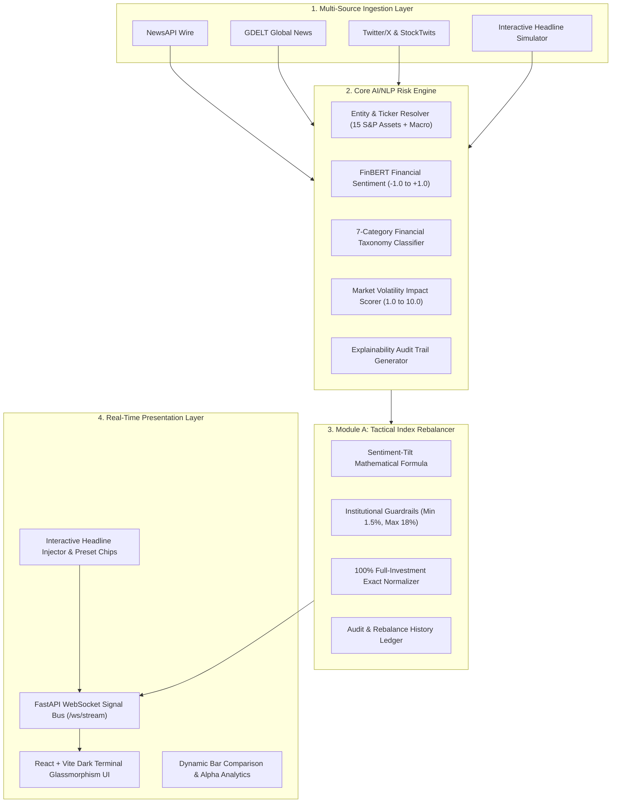

# AegisRisk AI — Real-Time Financial NLP Risk Engine & Tactical Index Rebalancer
### S&P Global & CRISIL Campus Hackathon 2026 Submission

[](https://www.python.org/downloads/)
[](https://fastapi.tiangolo.com)
[](https://react.dev/)
[](https://vitejs.dev/)
[](LICENSE)

---

## 📌 Executive Summary

Over **80% of market-moving financial signals originate in unstructured text** (breaking news wires, regulatory filings, analyst chatter, social media sentiment). Traditional quantitative models only react *after* stock prices have already crashed or spiked.

**AegisRisk AI** is an enterprise-grade, real-time risk intelligence and portfolio rebalancing platform engineered for **S&P Global & CRISIL Hackathon 2026 (Module A: Tactical Index Rebalancer)**:
1. **Multi-Source Ingestion**: Ingests real-time streaming feeds across financial news (NewsAPI, GDELT) and social chatter (Twitter/X, StockTwits).
2. **AI/NLP Risk Engine**: Performs sub-second Named Entity Recognition (NER), financial sentiment scoring ($-1.0$ to $+1.0$), 7-category event taxonomy classification, impact severity scoring ($1.0$ to $10.0$), and produces an audit explainability rationale.
3. **Module A — Tactical Index Rebalancer**: Dynamically tilts portfolio weights across a 15-stock S&P benchmark basket using bounded sentiment-tilt mathematical optimization within strict institutional risk guardrails ($1.5\%$ floor, $18.0\%$ ceiling, $100.0\%$ full investment).
4. **Glassmorphism Terminal UI**: Real-time WebSocket-powered dashboard featuring interactive headline injection, dynamic weight shift bars, live price feeds, and backtest alpha analytics.

---

## 🏛️ System Architecture



---

## 📊 Benchmark Basket (15 Core S&P Constituents)

| Ticker | Company Name | Sector | Base Equal Weight ($w_{0,i}$) |
| :--- | :--- | :--- | :--- |
| **AAPL** | Apple Inc. | Technology | $6.67\%$ |
| **MSFT** | Microsoft Corp. | Technology | $6.67\%$ |
| **NVDA** | Nvidia Corp. | Technology | $6.67\%$ |
| **GOOGL** | Alphabet Inc. | Communication Services | $6.67\%$ |
| **AMZN** | Amazon.com Inc. | Consumer Discretionary | $6.67\%$ |
| **META** | Meta Platforms Inc. | Communication Services | $6.67\%$ |
| **TSLA** | Tesla Inc. | Consumer Discretionary | $6.67\%$ |
| **JPM** | JPMorgan Chase & Co. | Financials | $6.67\%$ |
| **BAC** | Bank of America Corp. | Financials | $6.67\%$ |
| **GS** | Goldman Sachs Group Inc. | Financials | $6.67\%$ |
| **XOM** | Exxon Mobil Corp. | Energy | $6.67\%$ |
| **CVX** | Chevron Corp. | Energy | $6.67\%$ |
| **JNJ** | Johnson & Johnson | Healthcare | $6.67\%$ |
| **PFE** | Pfizer Inc. | Healthcare | $6.67\%$ |
| **UNH** | UnitedHealth Group Inc. | Healthcare | $6.67\%$ |

---

## 📐 Mathematical Formulation (Sentiment-Tilt Optimization)

For each asset $i \in \{1, \dots, N\}$ ($N=15$):

1. **Base Equal Weight**:
   $$w_{0, i} = \frac{1}{N} = \frac{100\%}{15} \approx 6.67\%$$

2. **Raw Tilt Formulation**:
   $$\tilde{w}_i = w_{0, i} \times \left(1 + \gamma \cdot S_i \cdot \frac{I_i}{10}\right)$$
   - $S_i \in [-1.0, +1.0]$: Sentiment score extracted by NLP engine.
   - $I_i \in [1.0, 10.0]$: Impact severity rating.
   - $\gamma = 0.5$: Active tilt sensitivity parameter.

3. **Institutional Risk Limits & Boundary Constraints**:
   $$\text{Floor Constraint: } w_i \ge 1.5\% \quad (\text{prevents forced liquidation})$$
   $$\text{Concentration Ceiling: } w_i \le 18.0\% \quad (\text{prevents idiosyncratic risk})$$
   $$\text{Full Investment Constraint: } \sum_{i=1}^{N} w_i = 100.00\% \quad (\text{strictly normalized})$$

---

## ⚡ Quickstart Guide

### Prerequisites
- Python 3.10+
- Node.js 18+ and npm

### 1. Backend Setup & Launch
```bash
# Navigate to backend directory
cd src/backend

# Install dependencies
pip install -r ../../requirements.txt

# Run FastAPI server (REST + WebSocket on port 8000)
python -m uvicorn main:app --host 0.0.0.0 --port 8000 --reload
```
* Backend Health Check: `http://localhost:8000/health`
* Interactive API Docs: `http://localhost:8000/docs`

### 2. Frontend Setup & Launch
```bash
# Navigate to frontend directory
cd src/frontend

# Install dependencies
npm install

# Start Vite Development Server
npm run dev
```
* Open your browser at: `http://localhost:5173`

---

## 📁 Repository Directory Structure

```
.
├── PROJECT_BLUEPRINT.md        # Comprehensive Hackathon Master Blueprint
├── README.md                   # Submission documentation and quickstart
├── LICENSE                     # MIT Open Source License
├── requirements.txt            # Python backend dependencies
├── data/                       # Ground-truth datasets and caches
│   ├── kaggle_sentiment_sample.csv   # Kaggle Financial PhraseBank dataset
│   ├── price_cache.json              # Cached market quotes for 15 constituents
│   ├── sample_news.json              # Pre-loaded financial news wires
│   └── sample_tweets.json            # Pre-loaded Twitter/StockTwits data
├── docs/                       # Presentation & architecture artifacts
│   ├── presentation.pdf              # 5-7 slide presentation deck
│   └── architecture.png              # System architecture visual
└── src/
    ├── backend/                # FastAPI Core & Quantitative Engine
    │   ├── ingestion.py        # Multi-source data adapter
    │   ├── nlp_engine.py       # FinBERT NER, Sentiment, Event & Impact engine
    │   ├── rebalancer.py       # Module A Sentiment-Tilt bounded optimizer
    │   ├── schemas.py          # Pydantic data contracts
    │   ├── test_pipeline.py    # End-to-end verification script
    │   └── main.py             # REST API & WebSocket signal bus
    └── frontend/               # React + Vite Dark Glassmorphism Dashboard
        ├── src/
        │   ├── components/
        │   │   ├── Header.tsx           # Status bar, radar pulse & simulation toggle
        │   │   ├── MetricsBar.tsx       # Executive KPI strip
        │   │   ├── HeadlineInjector.tsx # Interactive simulator & preset chips
        │   │   ├── SignalCard.tsx       # AI NLP extraction & explainability card
        │   │   ├── RebalancerView.tsx   # Dynamic weight adjustment matrix & delta bars
        │   │   ├── LiveFeedStream.tsx   # Real-time multi-source news stream
        │   │   └── PerformanceChart.tsx # Quantitative alpha backtest SVG chart
        │   ├── types.ts                 # TypeScript data contracts
        │   ├── App.tsx                  # Master application container
        │   └── index.css                # Glassmorphism design system
        └── package.json
```

---

## 🏆 Hackathon Compliance & Submission Checklist

- [x] **Repository Visibility**: Public GitHub repository with MIT License.
- [x] **Core AI/NLP Deliverable**: Multi-source ingestion ($\ge 2$ sources), Sentiment Score ($-1.0$ to $+1.0$), 7 Financial Event Taxonomies, and Impact Severity ($1$–$10$).
- [x] **Downstream Module**: **Module A — Tactical Index Rebalancer** with active weight bounds and 100% normalization.
- [x] **Data Submission**: Offline ground-truth datasets, financial phrasebank, and price caches stored in `/data`.
- [x] **Live Demonstration**: Functional live demo ($\le 5$ minutes) featuring interactive headline injector and real-time weight rebalancing.

---

## 📜 License
Distributed under the **MIT License**. See [`LICENSE`](LICENSE) for more information.
